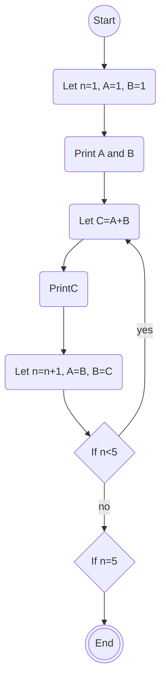

# Fibonnacci
Flowchart for the Fibonnacci series first 5 numbers

```mermaid
flowchart TD
A((Start))-->
B(Let n=1, A=1, B=1)-->
C(Print A and B)-->
D(Let C=A+B)-->
E(PrintC)-->
F(Let n=n+1, A=B, B=C)-->
G{If n<5}--yes -->D
G--no -->H{If n=5}-->
I(((End)))

```